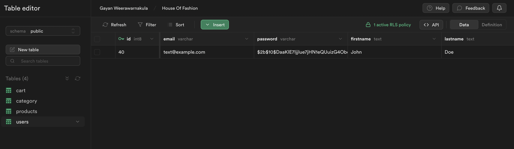

# House Of Fashion

## <ins>Description</ins>

This project is an online e-commerce website designed to mimic a fully functional online shopping platform. The goal in creating this project was to create a full stack application ( front-end, back-end, database ) and mesh each component in order to provide users with a complete online shopping experience.

## <ins>Features</ins>

### Register Page

Register Page that allows users to create own accounts. intergrated with a backend that hashes passwords and stores data in a supabase database system.

   

   
   

   

If a user inserts invalid inputs, error messages will display.

### Login Page

Login Page that allows users to log into their created accounts. intergrated with a express backend that uses supabase and passport to authenticate users.

   

   
   

If user insertts invalid inputs, error messages will display.

### Profile Page

Users can view their own profile page, with the option to add contact details if they previously haven't. The new details will be updated in the database.

### Item Page

User can add items to their cart from the item pages.

* stock levels displayed on the page
* if a user attempts to add an item with the quantity above the stock level an error message will be displayed.
* if a user successfully adds a quantity of an item to their cart, the amount of that item will be reduced from the stocks in the database while it is in the users cart.

### Cart page

Users can view their cart to see the items in the basket curently and the cart total is displayed

* items can be removed from the cart
* item quantity can be changed from the cart

**any changes made to item quantities will be directly reflected on the product table of the database**

**cart total amount will when the cart item quantities are changed**

### Responsive web design

The website is fully responsive to different types of devices with quality of life features for different devices, e.g on mobile devices large blocks of text can be toggled on or off for better user exeperience.

   

   <video src="./public/readme/mobileResponse1.mp4" width="500" controls ></video>
     
   <video src="./public/readme/mobileResponse2.mp4" width="500" controls ></video>
   

### Authorization protection

Sensitive pages like user cart or profile pages are protected by authorization middleware in the backend to ensure that users can only access authorized content.

## <ins>Development process</ins>

I started by drawing a wireframe sketches in order to get a feel for the layout and functionality of the website, once I was happy with the overall design I moved onto the development phase. I divided the development phase into smaller tasks, my methodoloy was to build a backend route and database queries first and then the front-end components that would employ it. At the end of each backend + frontend component cycle I tested the whole unit using Cypress and postman.Once I felt the unit was secure and functional I deployed the code to GitHub/netlify/render.

## <ins>Challenges</ins>

The main challenge that I came across during the making of this project was to do with cookies. I tried setting a user-id cookie from the backend but I couldn't get it to work, I spent hours trying to find the solution in websites such as stackoverflow and other similar forums, eventually I found that it is not possible to set cookies from a backend that is on a different domain to the front end so I opted to set the cookie on the front-end to circumvent this issue.

Other minor challenges that I encountered were mostly to do with framer-motion but I was easily able to solve the issues after looking through the docs/videos.
